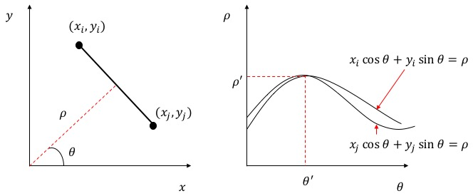

# Lane Detection

Lane detection is one of the primary systems in an autonomous car and mobile robots. 

During my Advanced Mobile Robotics course at Western Sydney University, we were given four images and we were supposed to use all the combinations of image processing operations to detect the lanes on a road.

In the program ```lane_detection_test.py```, I used image dilation and thinning operations to detect the lines. This program was valid for the four test images and it did not work very well on the video footage.


It may appear that there is a need for using a proper set of algorithms depending upon the orientation of the camera. In the four test images, the road the primary focus in the image. However, if the camera captures the horizon on the road, then it becomes difficult to filter out the noise. Therefore, in such case a region of interest (ROI) is necessary. This region of interest depends upon the resolution of the image from the camera. This is demonstrated with the code in ```lane_test.py``` and the code is implemented to process the video in ```lane_test_video.py```


## Hough Transforms



## Mid-Line Calculations


